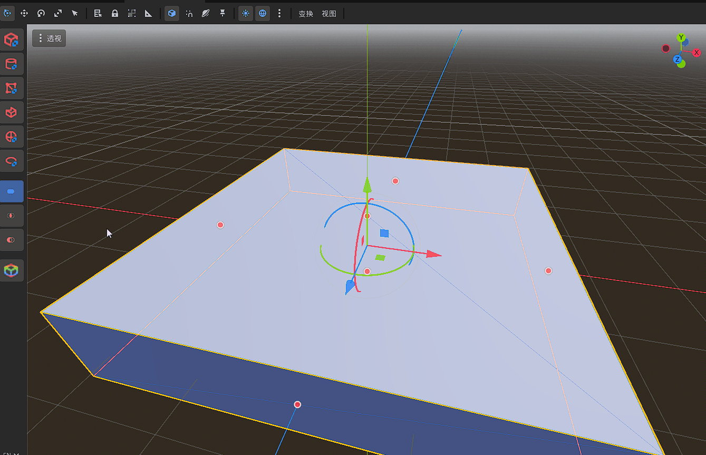
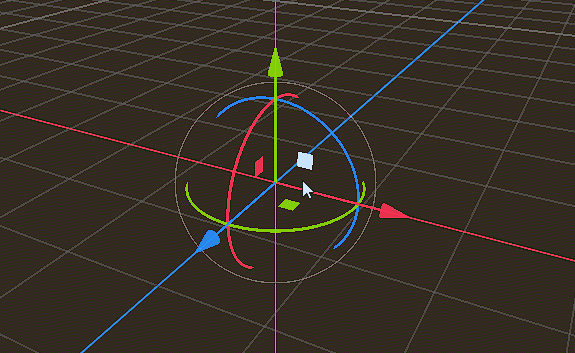
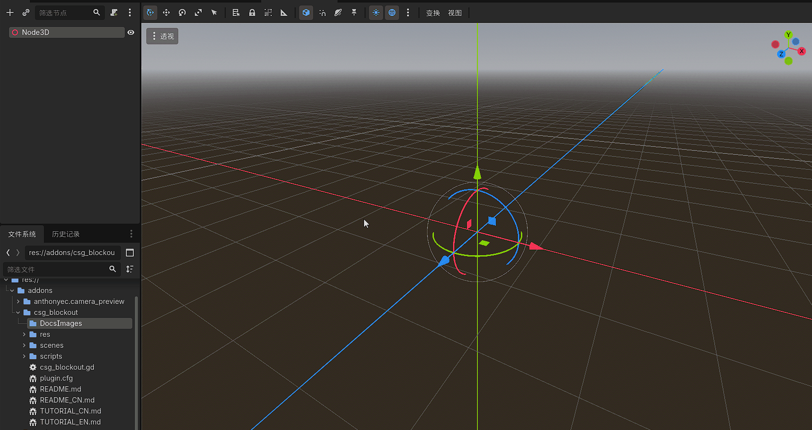
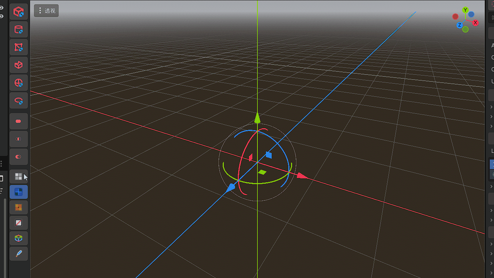

# CSG Blockout 快速搭建与高级工作流教程

*Read this in other languages: [English](TUTORIAL_EN.md).*

## 目录
- [一、 基础篇：CSG 的基本概念](#一-基础篇csg-的基本概念)
- [二、 工作流篇：极速搭建方案](#二-工作流篇极速搭建方案)
- [三、 进阶篇：阵列与散布系统](#三-进阶篇阵列与散布系统)
- [四、 终极奥义：性能优化工作流 (必读)](#四-终极奥义性能优化工作流-必读)

---

## 一、 基础篇：CSG 的基本概念

**CSG (Constructive Solid Geometry，构造实体几何)** 是一种允许你通过对简单几何体（如立方体、球体、圆柱体）进行布尔运算，从而构造出复杂 3D 模型的技术。

在 Godot 中，CSG 是关卡设计师搭建“白盒（Blockout）”或进行快速原型设计的利器。其核心基于三种布尔操作：
- **并集 (Union)**：将两个几何体合并为一个整体。
- **交集 (Intersection)**：只保留两个几何体相互重叠的部分。
- **差集 (Subtraction)**：从一个几何体中“挖去”另一个几何体的体积。

利用这些简单的操作，你可以迅速在场景中切出门洞、挖出地道或拼凑出复杂的建筑结构，而无需使用 Blender 等外部建模软件。

---

## 二、 工作流篇：极速搭建方案

CSG_Blockout 插件旨在打破繁琐的层级操作，提供所见即所得的极速搭建体验。无论是偏好鼠标点击还是快捷键的开发者，都能找到最顺手的方式。

### 推荐搭建流程
1. **建立根节点**：在你的场景中添加一个 `CSGCombiner3D` 节点作为整个几何体的根容器。所有后续添加的基础形状都会自动合并在这个节点下。
2. **选中目标**：确保在场景树中选中这个 `CSGCombiner3D` 节点（或它内部的其他 CSG 形状）。
3. **呼出菜单**：
   - **方式 A (轮盘菜单)**：将鼠标移至 3D 视口中，按下快捷键 `Shift + A`，即可在鼠标位置唤出 3D 轮盘菜单（Pie Menu）。顺着鼠标方向滑动即可快速选择布尔操作并生成基础形状。
     
     
     
   - **方式 B (侧边栏)**：直接使用 3D 视口左侧新增的插件侧边栏。首先点击下方图标选择布尔操作类型（并集、交集或差集），然后再点击上方的几何体图标（如立方体、球体等），即可一键添加带有该操作属性的 CSG 节点。
     
     
4. **网格材质与原型度量**：
   - **程序化世界对齐网格**：侧边栏内置了三种开箱即用的世界对齐网格材质（灰白网格、深灰网格、橙色高亮网格），以及白模（无材质）与自定义材质通道。网格基于三平面投影（Triplanar），在物体旋转或缩放时不会发生纹理畸变或拉伸，非常适合在关卡前期度量角色尺度和空间距离。
   - **一键批量赋材质**：在视口或场景树中多选任意 `CSGShape3D` 节点，点击侧边栏材质组底部的 **“应用材质到选中节点”** 按钮，即可将当前激活的预设材质批量赋给所有选中节点。全流程支持 `Ctrl + Z` 撤销/重做。
     
     
     
5. **智能层级挂载**：
   - 选中 `CSGCombiner3D`（或 `CSGRepeater3D` / `CSGSpreader3D`）时，新建节点将自动作为**子节点**挂载在其下方；
   - 选中普通 `CSGShape3D`（如 `CSGBox3D`）时，新建节点将自动作为**同级平级节点**插入在当前选中节点之后，无需手动调整层级树。
6. **调整修改**：直接在视口中拖拽手柄调整大小和位置，由于工具全线支持 `Ctrl+Z`，你可以大胆地尝试任何修改。

---

## 三、 进阶篇：阵列与散布系统

### 1. 阵列系统 (CSGRepeater3D)
`CSGRepeater3D` 允许你通过特定的数学模式快速生成重复的几何体，非常适合制作楼梯、栅栏、柱列或环形阵列场景。

**核心操作步骤**：
1. **创建节点**：在场景中添加一个 `CSGRepeater3D` 节点。
2. **设置模板**：你可以直接将一个基础的 CSG 节点（如 `CSGBox3D`）作为 `CSGRepeater3D` 的子节点，或者在其属性面板中为 `Template Node` 分配目标节点。
3. **选择阵列模式**：在 Inspector (检查器) 中，找到 `Pattern` 属性，新建你需要的分发模式：
   - `CSGGridPattern`：**网格阵列**，可自由调整 X/Y/Z 三轴的生成数量与间距。
   - `CSGCircularPattern`：**环形阵列**，通过控制半径和数量，让物体围绕中心呈环形分布。
   - `CSGSpiralPattern`：**螺旋阵列**，在环形的基础上增加高度偏移，是制作螺旋楼梯的绝佳工具。
   - `CSGNoisePattern`：**噪声阵列**，基于 3D 噪声进行有序的随机偏移。

### 2. 散布系统 (CSGSpreader3D)
`CSGSpreader3D` 独家集成了**空间哈希网格（Spatial Hash Grid）** 算法，能够在任意 3D 碰撞体范围内高效、随机且**无重叠**地散布几何体。即使散布大量物体，O(1) 级别的避障检测也能确保编辑器丝滑不卡顿。

**核心操作步骤**：
1. **创建节点**：添加 `CSGSpreader3D` 节点并赋予它一个需要被散布的子节点模板。
2. **划定散布范围**：在属性面板中，指定一个 `Shape3D`（如 `BoxShape3D` 或 `SphereShape3D`），散布将严格限制在此碰撞体范围内。
3. **调整密度与随机性**：
   - **Min Distance (最小安全距离)**：这是控制散布密度的最关键属性。设置越大分布越稀疏，设置越小分布越密集。
   - 配合面板中的随机旋转（Random Rotation）和随机缩放（Random Scale），瞬间生成杂乱但自然的地形或废墟。

---

## 四、 终极奥义：性能优化工作流 (必读)

CSG 节点在编辑阶段非常方便，但由于其实时布尔运算的特性，如果在最终游戏运行时保留大量的 CSG 节点，将会造成**严重的性能损耗（掉帧）**。
当你的某一个房间或建筑区块已经“确定不改动”时，**必须**将其转换为静态网格和碰撞体。

**一键转换标准流程**：
1. **完成搭建**：选中包含你所有操作的那个顶级 `CSGCombiner3D` 节点。
2. **烘焙网格**：在编辑器顶部菜单栏点击 `CSGCombiner3D` 的专属选项，选择 **“烘焙为网格实例 (Bake to MeshInstance3D)”**（或直接创建/转换）。
3. **生成碰撞体**：选中刚刚生成的 `MeshInstance3D`，在顶部菜单点击“Mesh（网格）”，选择 **“创建三角网格碰撞体 (Create Trimesh Static Body)”**。此操作会自动为你生成极其贴合表面的碰撞体。
4. **清理现场**：将生成的 `MeshInstance3D` 连同其内部的 `CollisionShape3D` 移动到一个单独的 `StaticBody3D` 层级结构下。
5. **删除原 CSG**：**直接删除**原来的 `CSGCombiner3D` 节点及其所有子节点。此时，沉重的布尔计算完全卸载，你得到的是一个性能极高、带有完美碰撞的静态游戏场景素材！

> [!WARNING]
> ⚠️**注意**：删除 CSG 节点前，建议将原始 CSG 节点结构保存为单独的 `CSG_Source.tscn` 场景文件或备用，以便后续修改关卡结构。
